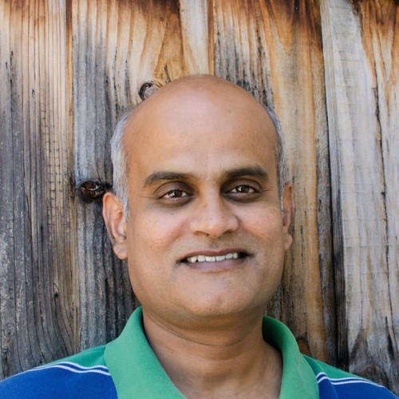

 
  Dinesh.Gaitonde@gmail.com   mobile: +1 408-xxx-xxxx   Citizenship: USA

# Dinesh Gaitonde  

## Executive Summary
* Over 20 years experience in the semiconductor industry
* Several patents and publications in
  * FPGA Fabric and NoC Architecture
  * EDA algorithms for physical design in ASICs and FPGAs
  * Static Timing Analysis, Delay Calcuation
  * Performance Evaluation of fabric and fabric adjacent SoC blocks

## Working Experience

#### AMD (Senior Fellow, 2022/06 - present)

* Next Generation Fabric Architectures – Microarchitecture and performance evaluation
* Reducing pessimism in methodologies to squeeze more PPA from products
* Extending performance evaluation to more heterogenous platforms and newer workloads
* Toolchains to manage the heterogenous integration at device and package levels of next gen platforms
* Define market leading product offerings at next generation in terms of PPA
* Align architectures with future algorithm and other tool capabilities
* Predict architecture capabilities with better accuracy, and close the loop with product deliverables
* Permit competitive use of FPGAs in more domains via heterogenous integrations

#### Xilinx (Distinguished Engineer, 2015/01 - 2022/06) 

* Managed team responsible for AMD/Xilinx FPGA architectures since Virtex7 (28nm)
* Led team of 5 for application development
* Coordinated with developers, support staff and vendors across Hong Kong, China, Taiwan

### Xilinx (Principal Engineer, 2005/08 - 2015/01)

#### Synopsys (Sr. Staff Software Engr, 2003/10 - 2005/08)

### Monterey Design Systems (MTS, 1998/04 - 2003/10)

### Motorola Inc. (Staff Software Engineer, 1995 - 1998)

## Projects: 

* [Casual-Markdown](https://github.com/casualwriter/powerpage) - a lightweight markdown parser
* [Powerpage](https://github.com/casualwriter/powerpage) - a lightweight browser for html applications

## Education & Qualifications

* Ph.D. Electrical Engineering (Carnegie Mellon, 1995)
* M.Tech. Electrical Engineering (IIT Bombay, 1990)
* B.Tech. Electrical Engineering (IIT Bombay 1988)

## Misc. Information

* Languages: English (good), Cantonese (fluent/native), Mandarin (good)
* Availability: 1 month's notice
